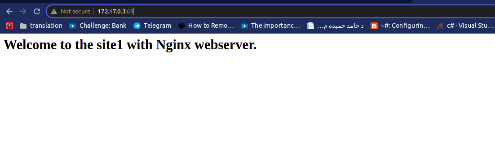
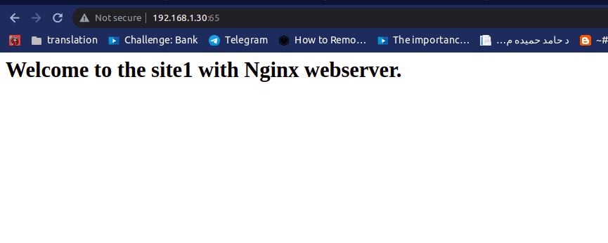
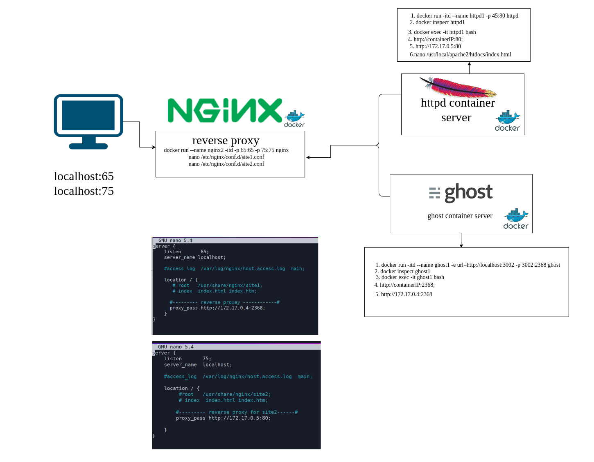
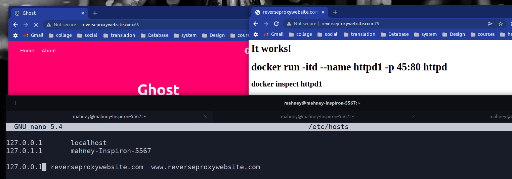
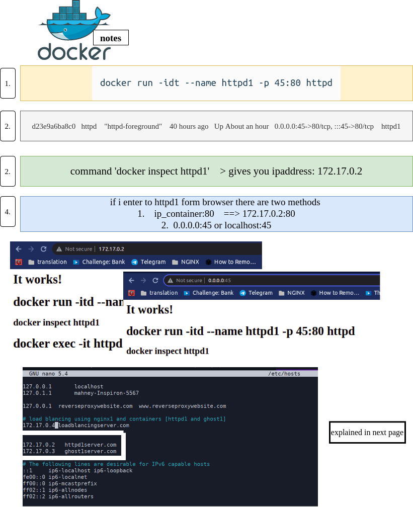

# 💚 NGINX 


## 💙 Content

 - 🎋 Topics
 - 🎋 Introduction to NGINX
 - 🎋 How to install NGINX 
 - 🎋 Introduction to NGINX's Configuration Files
 - 🎋 How to start and enter the Nginx container 
 - 🎋 How to show help inside nginx container                                                             
 - 🎋 How to update the location directive in Nginx from *default.conf*                             
 - 🎋 How to run more than website(container) on one contair NGINX from *Nginx image*                      
 - 🎋 default.conf  **/etc/nginx/conf.d/default.conf** : Nginx configuration file                
 - 🎋 Reverse Proxy for two web sites                                                            
 - 🎋 how to add URL for any ip in etc/hosts                                                        
 - 🎋 how to add URL for any ip of container in etc/hosts and another notes                         
 - 🎋 load balancing for two containers [httpd1 and ghost1] with nginx1 container                 
 - 🎋 Another method : load balancing for two containers [httpd1 and ghost1] with nginx1 container 
 - 🎋 Nginx comman commands


<p align="center">
  <code></code>
</p>


## Topics ☄️
 - NGINX is open source , i will :
    * Configure NGINX as a web server . 
    * Reverse proxy server.
    * load balancer from scratch.
    * Optimize NGINX to get maximum performance out of your server. 
## Introduction to NGINX ☄️

   - NGINX is a high performance web server . 
   - NGINX is developed to facilitate the increasing needs of the modern web.
   - It focuses on
      -  high performance .
      -  high concurrency .
      -  low resource usage. 
   -  Although it's mostly known as a web server , NGINX at its core is a reverse proxy server.
   - server admins often prefer NGINX for two main reasons:
      - It can handle a higher number of concurrent requests.
      - It has faster static content delivery with low resource usage.
   - NGINX is faster in static content delivery . 
       - NGINX simply responds with the file without running any additional processes.
   - That doesn't mean that NGINX can't handle requests that require a dynamic programming language processor . 
       - give dynamic requests to WSGI in python 
   - NGINX is also a lot easier to configure .
   - easily maintainable configuration files .

# How to install NGINX ☄️
 
  - write the following commands 
   
    ```
    sudo apt update && sudo apt upgrade -y
    sudo apt install nginx -y
    ```
  - NGINX is usually installed on the following directory  

    ```
    /etc/nginx
    ``` 

# Introduction to NGINX's Configuration Files ☄️

 - **Nginx.conf**: The main NGINX configuration file, which can be found in the container at the following path. 
   
   ```
   cd /etc/nginx/nginx.conf
   ```
 
 - Let's rename **Nginx.conf** and create a new empty one before configuring it . 
  
   ```
   # renames the file
   sudo mv nginx.conf nginx.conf.backup
   
   # creates a new file
   sudo touch nginx.conf 
   ```
 - show the default configuration file in Nginx 
   
   ```
   cat //etc/nginx/nginx.conf.backuo
   ```
 - the result of previous command , Default configuration file 
   ```
   user  nginx;

   worker_processes  auto;
   
   error_log  /var/log/nginx/error.log notice;
   pid        /var/run/nginx.pid;
   
   
   events {
       worker_connections  1024;
   }
   
   
   http {
       include       /etc/nginx/mime.types;
       default_type  application/octet-stream;
   
       log_format  main  '$remote_addr - $remote_user [$time_local] "$request" '
                         '$status $body_bytes_sent "$http_referer" '
                         '"$http_user_agent" "$http_x_forwarded_for"';
   
       access_log  /var/log/nginx/access.log  main;
   
       sendfile        on;
       #tcp_nopush     on;
   
       keepalive_timeout  65;
   
       #gzip  on;
   
       include /etc/nginx/conf.d/*.conf;
   }
   ```
##  How to return massege using nginx  ☄️

   
   - enter to the main configuration file 
     ```
     nano /etc/nginx/nginx.conf
     ```
   - write the the foloowing configuration 
     
     ```
     events{}

     http {
     
      server{
     
         listen 80 ;
         server_name localhost ;
     
          ## How to run your first masseg using nginx.conf
              return 200 " My name is : Mahney Elbana ";
        }
     
     }


     ```  


## Two of the most important terminologies of NGINX configuration files  ☄️
  
  - They are directives and contexts.
      - Everything inside a NGINX configuration file is a directive.
      - Directives are of two types:
         - Simple Directives (listen , return)
         - Block Directives (context ) (http ,events , server)

## How to start and enter the Nginx container   ☄️
  
  - How to run Nginx Container ☄️
    
    ```
    docker run --name nginx1 -itd -p 50:80 nginx
    ``` 
  - How to run Nginx Container ☄️
    
    ```
    docker exec -it nginx1 bash
    ``` 
        
## How to show help inside nginx container ☄️

 - Write the following command in terminal :

     ```
     nginx -h
     ```

  - the result of command :

      ```
       nginx version: nginx/1.21.6
       Usage: nginx [-?hvVtTq] [-s signal] [-p prefix]
                    [-e filename] [-c filename] [-g directives]
       
       Options:
         -?,-h         : this help
         -v            : show version and exit
         -V            : show version and configure options then exit
         -t            : test configuration and exit
         -T            : test configuration, dump it and exit
         -q            : suppress non-error messages during configuration testing
         -s signal     : send signal to a master process: stop, quit, reopen, reload
         -p prefix     : set prefix path : (default/etc/nginx/)
         -e filename   : set error log file (default: /var/log/nginx/error.log)
         -c filename   : set configuration file (default: /etc/nginx/nginx.conf)
         -g directives : set global directives out of configuration file
      ```

--------------------------------------------------------------------------------------------
--------------------------------------------------------------------------------------------
--------------------------------------------------------------------------------------------

## How to update the location directive in Nginx from *default.conf*  ☄️
  
  - Enter to the following directory "/etc/nginx/conf.d
     
     ```
     cd /etc/nginx/conf.d
     ```
  - Open default.conf
     
     ```
     sudo nano default.conf
     ```
  - Update location 
     
     ```
     location / {
        ## default root and index 
        # root   /usr/share/nginx/html;
        # index  index.html index.htm;
        
        ## my root and my index 
        root   /usr/share/nginx/mahney;
        index  mah.html mah.htm;
      }

     ``` 
  - Enter the following path "/usr/share/nginx"

     ```
     cd /usr/share/nginx
     ``` 
  - Create folder/directory

     ```
     mkdir mahney
     ``` 
  - Enter the following path "/usr/share/nginx/mahney"

     ```
     cd /usr/share/nginx/mahney
     ```      
  - Create html file 

     ```
     touch mah.html
     ```  
  - open html file and add contant

     ```
     nano mah.html
     ```  
  - Add  contant of html file :

     ```html
     <!DOCTYPE html>
       <html>
        <head>
          <title>mahney mah html file </title>
        </head>
        <body>
         <h1>update conf path </h1>
         <p>conf files </p>
       </body>
      </html>
     ```       
  - Test configuration and exit 

      ``` 
       nginx -t
      ```
  - Send signal to a master process: reload

      ``` 
       nginx -s reload 
      ```
--------------------------------------------------------------------------------------------
--------------------------------------------------------------------------------------------
--------------------------------------------------------------------------------------------

# <a id="N04"> How to run more than website(container) on one contair NGINX from *Nginx image* ☕

 - Configure **Nginx container** to Host Multiple Websites(containers) 🗒️
 - In this section, i use docker to run nginx image on two ports to run two web sites on one container (nginx) 🗒️
 - I will show you how to host two websites named **site1** and **site2** on a single **container nginx** 🗒️

 1. Execut the following command 

    ```
    docker run --name nginx2 -itd -p 65:65 -p 75:75 nginx
    ``` 

 2. Enter to the nginx container

     ```
     docker exec -it nginx2 bash
     ```  

    * Run the following command for each website:
      ```
        mkdir /usr/share/nginx/site1
        mkdir /usr/share/nginx/site2
      ```
    * First, create a index.html file for site1:
      ```
      nano /usr/share/nginx/site1/index.html
      ```
  
    * Add the following html markup in '/usr/share/nginx/site1/index.html':
      ```
       <html>
       <title>site1</title>
       <h1>Welcome to the site1 with Nginx webserver.</h1>
       </html>
      ```
  
    * Next create a index.html file for site2:
      ```
      nano /usr/share/nginx/site2/index.html
      ```
  
    * Add the following html markup in '/usr/share/nginx/site1/index.html':
      ```
      <html>
      <title>site2</title>
      <h1>Welcome to the site2</h1>
       </html>
      ```
    * For site 1, create a /etc/nginx/conf.d/site1.conf:
      ```
       nano /etc/nginx/conf.d/site1.conf
      ```  
    * Add the following lines in **/etc/nginx/conf.d/site1.conf**:
      ```
        server {
            listen       65;
            server_name  localhost;
        
            location / {
                root   /usr/share/nginx/site1;
                index  index.html index.htm;
            }
        }
      ```
    * For site 2, create a /etc/nginx/conf.d/site2.conf:
      ```
       nano /etc/nginx/conf.d/site2.conf
      ```        
    * Add the following lines in **/etc/nginx/conf.d/site2.conf**:
      ```
        server {
            listen       75;
            server_name  localhost;
        
            location / {
                root   /usr/share/nginx/site2;
                index  index.html index.htm;
            }
        }
      ```
  4. Test configuration and exit 
      ``` 
       nginx -t
      ```
  5. Send signal to a master process: reload
      ``` 
       nginx -s reload 
      ```
  6. You can access on any website from **ip address of container** : to get container ip = ``` docker inspect nginx2 ```

     

  7. You can access on any website from **localhost**

     

  8. You can access on any website from **ip address of my local device**
 
               

--------------------------------------------------------------------------------------------
--------------------------------------------------------------------------------------------
--------------------------------------------------------------------------------------------


# <a id="N05" >5. default.conf  **/etc/nginx/conf.d/default.conf** : Nginx configuration file ☕

```bash

server {
    listen       80;
    listen  [::]:80;
    server_name  localhost;

    #access_log  /var/log/nginx/host.access.log  main;

    location / {
        root   /usr/share/nginx/html;
        index  index.html index.htm;
    }

    #error_page  404              /404.html;

    # redirect server error pages to the static page /50x.html
    #
    error_page   500 502 503 504  /50x.html;
    location = /50x.html {
        root   /usr/share/nginx/html;
    }

    # proxy the PHP scripts to Apache listening on 127.0.0.1:80
    #
    #location ~ \.php$ {
    #    proxy_pass   http://127.0.0.1;
    #}

    # pass the PHP scripts to FastCGI server listening on 127.0.0.1:9000
    #
    #location ~ \.php$ {
    #    root           html;
    #    fastcgi_pass   127.0.0.1:9000;
    #    fastcgi_index  index.php;
    #    fastcgi_param  SCRIPT_FILENAME  /scripts$fastcgi_script_name;
    #    include        fastcgi_params;
    #}
    # deny access to .htaccess files, if Apache's document root
    # concurs with nginx's one
    #
    #location ~ /\.ht {
    #    deny  all;
    #}
}

```

--------------------------------------------------------------------------------------------
--------------------------------------------------------------------------------------------
--------------------------------------------------------------------------------------------

# <a id="NGINX6" > Reverse Proxy for two web sites ☕

  1. settings for site2 :
    ```
    docker run -itd --name some-ghost -e url=http://localhost:3002 -p 3002:2368 ghost
    docker inspect ghost1
    http://containerIP:2368;
    http://172.17.0.4:2368
    docker exec -it ghost1 bash
    ``` 
  1. settings for site1 :
   ```
    docker run -itd --name httpd1 -p 45:80 httpd
    docker inspect httpd1
    http://containerIP:80;
    http://172.17.0.5:80
    docker exec -it httpd1 bash
    nano /usr/local/apache2/htdocs/index.html
   ```

 1. settings for Nginx as reverse proxy
    ```
       docker run --name nginx2 -itd -p 65:65 -p 75:75 nginx
       nano /etc/nginx/conf.d/site1.conf
       nano /etc/nginx/conf.d/site2.conf
    ```
     * In /etc/nginx/conf.d/site1.conf 
     ```bash
       server {
         listen       65;
          server_name localhost;

        #access_log  /var/log/nginx/host.access.log  main;

       location / {
       # root   /usr/share/nginx/site1;
       # index  index.html index.htm;

      #--------- reverse proxey ------------#
      proxy_pass http://172.17.0.4:2368;
      }
    }
 
     ```
     * In /etc/nginx/conf.d/site2.conf 
     ```bash
         server {
          listen       75;
          server_name  localhost;

         #access_log  /var/log/nginx/host.access.log  main;

       location / {
          #root   /usr/share/nginx/site2;
          # index  index.html index.htm;

         #--------- reverse proxy for site2------#
         proxy_pass http://172.17.0.5:80;

           }
        }
       ```  
--------------------------------------------------------------------------------------------
--------------------------------------------------------------------------------------------
--------------------------------------------------------------------------------------------

# <a id="NGINX7" > how to add URL for any ip in etc/hosts☕ 
```
sudo nano /etc/hosts
```




# <a id="NGINX8" > how to add URL for any ip of container in etc/hosts and another notes ☕ 
```
sudo nano /etc/hosts
```




# <a id="NGINX9" >load balancing for two containers [httpd1 and ghost1] with nginx1 container ☕ 

* go to the following path in nginx1 container :
  ``` 
   nano /etc/nginx/nginx.conf
  ```
     * add the following settings =>  [192.168.1.9]=[local device ip address]
        ```
             http {
             
             
                upstream all{
                    # server   hostname:port or ip_address:port ;
                    # server  172.17.0.3:2368 weight=4 ;
                    server   192.168.1.9:3002;
                    server  172.17.0.2:80 ;
                }
             
               server {
             
                   listen   80;
                   server_name  loadblancingserver.com;
             
                  location / {
                     proxy_pass http://all;
                  }
             
               }
             
             }
        ```

# <a id="NGINX10" >Another method : load balancing for two containers [httpd1 and ghost1] with nginx1 container ☕

* go to the following path in nginx1 container :
  ``` 
   nano /etc/nginx/conf.d/site1
  ```
     * add the following settings 
        ```
          server {
              listen   80;
              server_name  loadblancingserver.com;
          
              location / {
          
                   # proxy_pass http://172.17.0.5:2368/;
                   #  proxy_set_header X-real-IP $remote_addr;
                 proxy_pass http://all;
               }
          
            }
        ```
* go to the following path in nginx1 container :

  ``` 
   nano /etc/nginx/nginx.conf
  ```
     * add the following settings 
        
        ``` 
        http {
             
             
                upstream all{
                 # server  172.17.0.3:2368 weight=4 ;
                   server   192.168.1.9:3002;
                   server  172.17.0.2:80 ;
               }
             
              include /etc/nginx/conf.d/*.conf;
              #include /etc/nginx/conf.d/site1.conf;
             
             #  server {
             
             #      listen   80;
             #      server_name  loadblancingserver.com;
             
             #     location / {
             #        proxy_pass http://all;
             #    }
             
               }
             
             }
        ```

               or
        ```
          http {
          
                include       /etc/nginx/mime.types;
                default_type  application/octet-stream;
             
                 log_format  main  '$remote_addr - $remote_user [$time_local] "$request" '
                                   '$status $body_bytes_sent "$http_referer" '
                                   '"$http_user_agent" "$http_x_forwarded_for"';
             
                 access_log  /var/log/nginx/access.log  main;
             
                 sendfile        on;
                 #tcp_nopush     on;
             
                 keepalive_timeout  65;
             
                 #gzip  on;
             
                upstream all{
                    # server  172.17.0.3:2368 weight=4 ;
                    server   192.168.1.9:3002;
                    server  172.17.0.2:80 ;
                }
                 include /etc/nginx/conf.d/site1.conf;
           }
           
         ```


# <a id="N11">Nginx comman commands☕

 - How to display the status of the Nginx service ☄️

   ```
   sudo systemctl status nginx
   ```
 - How to  stop the Nginx service ☄️

   ```
   sudo systemctl stop nginx
   ```
 - How to  stop the Nginx service ☄️

   ```
   sudo systemctl stop nginx
   ```

 - How To start Nginx ☄️

   ```
   sudo systemctl start nginx
   ```
   
 - How to Restart Nginx ☄️

   ```
   sudo systemctl reload nginx
   ```

 - Force Restart Nginx ☄️

   ```
    sudo systemctl restart nginx
   ```
 - Nginx Reload ☄️

   ```
   sudo nginx -s reload
   ```
 - Force close the Nginx service by using the quit ☄️

   ```
   sudo nginx -s quit
   ```
 - To disable or stop the Nginx service ☄️

   ```
   sudo nginx -s stop
   ```
 - How To the Nginx configurations ☄️

   ```
   sudo nginx -t
   ```
 - Use the enable option with the systemctl command to enable Nginx ☄️

   ```
   sudo systemctl enable nginx
   ```

 - Use the disable option with the systemctl command to disable Nginx ☄️

   ```
   sudo systemctl disable nginx
   ```

# <a id="N12">Nginx comman commands☕


# How to Cache Static Content 
  
  - for optimizing your server is caching static content (css ,images ,js) .


  ```

  events {
  }
  
  http {
  
      include /env/nginx/mime.types;
  
      server {
  
          listen 80;
          server_name localhost;
  
          root /home/project ;
          
          # How to cash static files 
          # -------------------------------# 
          
          location ~* \.(css|js|jpg)$ {
              access_log off;
              
              add_header Cache-Control public;
              add_header Pragma public;
              add_header Vary Accept-Encoding;
              expires 1M;
          }
         
         # -------------------------------# 
      }
  }
  ```


# qwertyup{}[]QEGHBDasdfghkzxcvbnm<>?789654123@#$%^&*()+=-


 1-  build ==> container   ip:port 
 2-  nginx ==> ngnix.conf ==> reverse proxey  platrain
 3- ip ==> domain name 
 4- cerbot ssl stl ==> https    


 version: '3.8'
services:
  # django container 
  djangoapp:
    container_name: djangoproapp
    restart: always
    build:
      context: .
    #command: gunicorn -c conf/gunicorn_config.py project.wsgi 
    volumes:
      - /media/hardmahney/E_Conclusion/example2/project:/code
      #- static:/static
    ports:
      - "8000:8000"
  # nginx container 
  nginx:
    image: nginx:latest
    container_name: nginxproapp
    restart: always
    ports:
      - "6666:80"
    volumes:
      - /media/hardmahney/E_Conclusion/example2/nginx/nginx.conf:/etc/nginx/nginx.conf
      #- static:/static
    depends_on:
      - djangoapp

--------------------------------------------------------------------------------------------
--------------------------------------------------------------------------------------------
--------------------------------------------------------------------------------------------

# Installing SSL/CertBot in an Nginx container to create nginx-certbot image   🔭

 - First step ☄️
   ```
   
   docker run -itd  --name certbot -p 789:80 nginx
   
   docker exec -it certbot bash
   
   apt update 
   
   apt install nano 
   
   apt-get install certbot
   
   apt install python3-certbot-nginx
   
   docker commit certbot mahney/nginx-certbot:v1
   
   sudo docker login
   
   sudo docker push mahney/nginx-certbot:v1
   ```
 - How to apply certbot or ssl on **mahney/nginx-certbot:v1** ☄️
   ```
   docker run --name certbotnginx -p 80:80 -itd mahney/nginx-certbot:v1
   ```
   ```
   docker ecec -it certbotnginx bash 
   ```
   ```
   certbot --version
   ```
   ```
   certbot --nginx -d example.com -d www.your_domain_name
   or
   certbot --nginx
   ```
   ```
   # Saving debug log to /var/log/letsencrypt/letsencrypt.log
   # Plugins selected: Authenticator nginx, Installer nginx
   # Enter email address (used for urgent renewal and security notices)
   #  (Enter 'c' to cancel): shovik.is.here@gmail.com
   
   # - - - - - - - - - - - - - - - - - - - - - - - - - - - - - - - - - - - - - - - -
   # Please read the Terms of Service at
   # https://letsencrypt.org/documents/LE-SA-v1.2-November-15-2017.pdf. You must
   # agree in order to register with the ACME server. Do you agree?
   # - - - - - - - - - - - - - - - - - - - - - - - - - - - - - - - - - - - - - - - -
   # (Y)es/(N)o: Y
   
   # - - - - - - - - - - - - - - - - - - - - - - - - - - - - - - - - - - - - - - - -
   # Would you be willing, once your first certificate is successfully issued, to
   # share your email address with the Electronic Frontier Foundation, a founding
   # partner of the Let's Encrypt project and the non-profit organization that
   # develops Certbot? We'd like to send you email about our work encrypting the web,
   # EFF news, campaigns, and ways to support digital freedom.
   # - - - - - - - - - - - - - - - - - - - - - - - - - - - - - - - - - - - - - - - -
   # (Y)es/(N)o: N
   # Account registered.
   
   # Which names would you like to activate HTTPS for?
   # - - - - - - - - - - - - - - - - - - - - - - - - - - - - - - - - - - - - - - - -
   # 1: nginx-handbook.farhan.dev
   # - - - - - - - - - - - - - - - - - - - - - - - - - - - - - - - - - - - - - - - -
   # Select the appropriate numbers separated by commas and/or spaces, or leave input
   # blank to select all options shown (Enter 'c' to cancel): 
   # Requesting a certificate for nginx-handbook.farhan.dev
   # Performing the following challenges:
   # http-01 challenge for nginx-handbook.farhan.dev
   # Waiting for verification...
   # Cleaning up challenges
   # Deploying Certificate to VirtualHost /etc/nginx/sites-enabled/default
   # Redirecting all traffic on port 80 to ssl in /etc/nginx/sites-enabled/default
   
   # - - - - - - - - - - - - - - - - - - - - - - - - - - - - - - - - - - - - - - - -
   # Congratulations! You have successfully enabled
   # https://nginx-handbook.farhan.dev
   # - - - - - - - - - - - - - - - - - - - - - - - - - - - - - - - - - - - - - - - -
   
   # IMPORTANT NOTES:
   #  - Congratulations! Your certificate and chain have been saved at:
   #    /etc/letsencrypt/live/nginx-handbook.farhan.dev/fullchain.pem
   #    Your key file has been saved at:
   #    /etc/letsencrypt/live/nginx-handbook.farhan.dev/privkey.pem
   #    Your certificate will expire on 2021-07-30. To obtain a new or
   #    tweaked version of this certificate in the future, simply run
   #    certbot again with the "certonly" option. To non-interactively
   #    renew *all* of your certificates, run "certbot renew"
   #  - If you like Certbot, please consider supporting our work by:
   
   #    Donating to ISRG / Let's Encrypt:   https://letsencrypt.org/donate
   #    Donating to EFF:                    https://eff.org/donate-le
   ```

 - the urls of How to Configure SSL ☄️

   - [ssl/certbot](https://www.freecodecamp.org/news/the-nginx-handbook/#how-to-configure-ssl-and-http-2)
   - [ssl/certbot](https://www.nginx.com/blog/using-free-ssltls-certificates-from-lets-encrypt-with-nginx/)
   - [ssl/certbot/yutube](https://www.youtube.com/watch?v=WPPBO-QpiJ0)
# First Traning on Nginx 

 - the path of configuration file
    ```
    /etc/nginx/nginx.conf
    ```
 - configuration file
    ```
    events {}
   
    http{

     server{
        listen 80 ;
        server_name localhost 0.0.0.0 127.0.0.1 ;
        return 200 "first your web server using Nginx" ;
       }
   
    }
    ```
 - test and reload nginx 
   ```
   sudo nginx -t && sudo nginx -s reload
   ```
 # Second Traning on Nginx from directory 
   ```s
   /etc/nginx/mahney_website
    html.index
   ```  
   ```html
   <html>

    <head>
    <h1 align="center"> this is index.html</h1>
    </head>
    <bood>
    <p align="center"> nginx serves html file </p>
    </body>

   </html>
   ```
   ```nginx

    events {}

    http{

    server{
       listen 80 ; 
       server_name localhost 0.0.0.0 127.0.0.1 ;
       root /etc/nginx/mahney_website ;
     }
 
   }

   ```

# 
```css
h1 {
    background-color: blue;
}

```
```html
<!DOCTYPE html>
<html>
<head>
    <meta charset='utf-8'>
    <title>Page Title</title>
    <link rel='stylesheet' type='text/css' media='screen' href='./styles.css'>
   
</head>
<body>
    <h1> html with css files are serverd by : Nginx </h1>
</body>
</html>
```
```Nginx

events {}

 http{
   types {
      text/html html ;
      text/css css ;
   }

  server{
     listen 80 ; 
     server_name localhost 0.0.0.0 127.0.0.1 ;
     root /etc/nginx/mahney_website ;
    }
 
 }
```

#

```conf
events {}

 http{

   # types {
   #    text/html html ;
   #    text/css css ;
   # }
   include  mime.types;

  server{
     listen 80 ; 
     server_name localhost 0.0.0.0 127.0.0.1 ;
   
     root /etc/nginx/mahney_website ;

     location /second {
       alias /etc/nginx/mahney_website/mahney ;
     }
     
   #   location /mahney {
   #    root  /etc/nginx/mahney_website;
   #   }


      location /mahney {
      root  /etc/nginx/mahney_website;
      try_files /mahney/mahney.html /index.html = 404 ;
     }

    }
 
 }

```

```
```
```
```
```


cp -r /etc/nginx/mahney_website /home/mahney/Documents